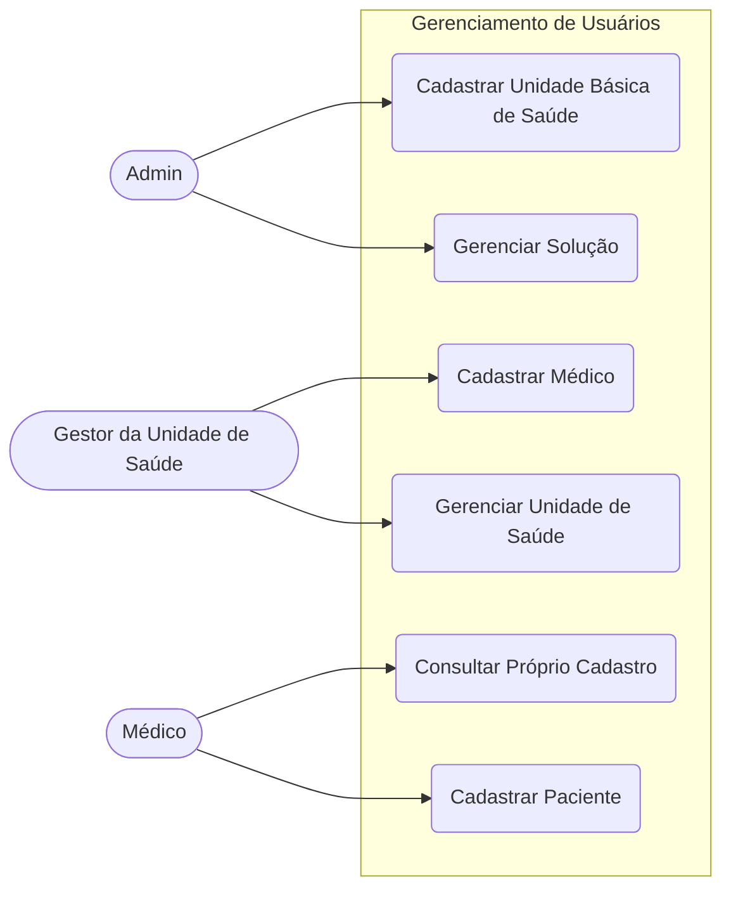
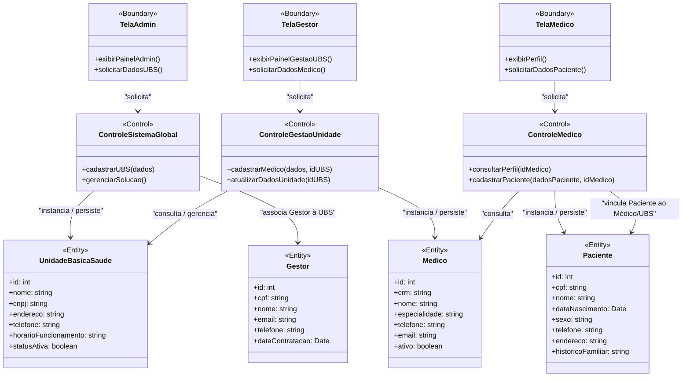

# Diagramas do Sistema: Mobile Diagn (Gerenciamento de Usuários)

Abaixo estão os diagramas atualizados, focados na parte de **gerenciamento de usuários** e unidades de saúde. Foram adicionados mais detalhes às entidades (atributos) e incluída a funcionalidade do Médico cadastrar pacientes.

## 1. Diagrama de Casos de Uso

Este diagrama ilustra as interações entre os atores responsáveis pela administração do sistema e pelo atendimento (Admin, Gestor da Unidade de Saúde e Médico).

> [!NOTE]
> - **Admin:** Atua no nível mais alto, gerenciando o sistema e sendo responsável por cadastrar as Unidades Básicas de Saúde (UBS).
> - **Gestor da Unidade de Saúde:** Atua localmente na sua respectiva UBS, com permissão para gerenciar as rotinas da unidade e cadastrar os Médicos associados a ela.
> - **Médico:** O profissional de saúde que pode consultar seus próprios dados e é o responsável pelo **cadastro dos Pacientes** no sistema.

---

## 2. Diagrama de Classe de Análise (Fronteira, Controle, Entidade)

O diagrama abaixo utiliza o padrão **ECB (Entity, Control, Boundary)**, com entidades enriquecidas de atributos e a adição do fluxo de gestão de pacientes.

