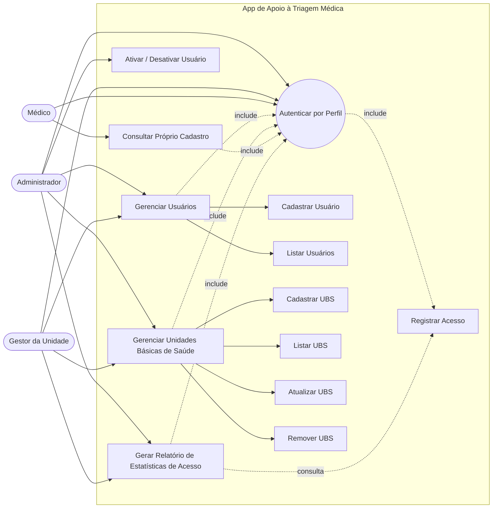
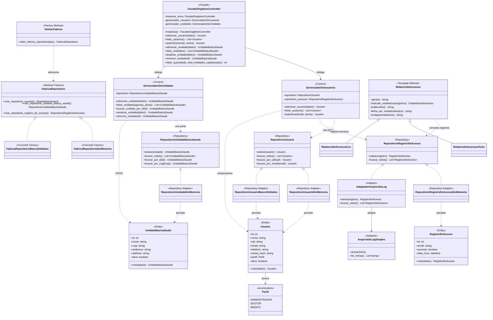

# Complemento de Documentação — Casos de Uso e Diagrama de Classe até Sprint 4

**Projeto:** App Experimental de Apoio à Triagem Médica  
**Contexto documentado:** Gerenciamento de usuários, unidades básicas de saúde e estatísticas de acesso.

Este documento complementa `docs/diagramas-sistema.md` com:

1. descrição dos 3 casos de uso mais relevantes;
2. diagrama de casos de uso contemplando os requisitos funcionais tratados até a Sprint 4;
3. diagrama de classe de análise considerando CRUD de duas entidades, Repository, Adapter e Template Method.

---

## 1. Descrição dos 3 casos de uso mais relevantes

### UC01 — Autenticar por perfil

| Campo | Descrição |
| ----- | --------- |
| Atores principais | Administrador, Gestor da Unidade, Médico |
| Objetivo | Permitir que um usuário acesse o sistema de acordo com seu perfil. |
| Pré-condições | O usuário deve estar cadastrado e ativo. |
| Pós-condições | O acesso é autorizado ou recusado; a tentativa de autenticação é registrada para estatísticas. |
| Requisitos relacionados | RF03 — Autenticar por perfil; NF008 — Controle de acesso por perfil. |

**Fluxo principal**

1. O usuário informa e-mail e senha.
2. O sistema valida se os campos obrigatórios foram preenchidos.
3. O sistema consulta o usuário pelo e-mail.
4. O sistema verifica a senha usando o hash armazenado.
5. O sistema verifica se o usuário está ativo.
6. O sistema registra a tentativa de acesso como `RegistroDeAcesso`.
7. O sistema libera o acesso conforme o perfil do usuário.

**Fluxos alternativos**

- Se o e-mail não existir ou a senha estiver incorreta, o sistema lança erro de credenciais inválidas.
- Se o usuário estiver inativo, o sistema recusa o acesso.
- Se e-mail ou senha estiverem vazios, o sistema retorna erro de validação.

---

### UC02 — Gerenciar usuários

| Campo | Descrição |
| ----- | --------- |
| Atores principais | Administrador, Gestor da Unidade |
| Objetivo | Cadastrar e consultar usuários que operam o sistema. |
| Pré-condições | O ator deve estar autenticado e possuir perfil autorizado. |
| Pós-condições | O usuário é cadastrado, listado ou validado conforme as regras de domínio. |
| Requisitos relacionados | RF02 — Gerenciar gestores e médicos; NF008 — Controle de acesso por perfil. |

**Fluxo principal**

1. O ator solicita o cadastro de um novo usuário.
2. O sistema recebe nome, CPF, e-mail, telefone, senha e perfil.
3. O sistema valida os dados obrigatórios e a força da senha.
4. O sistema verifica se já existe usuário com o mesmo CPF.
5. O sistema cria a entidade `Usuario`.
6. O sistema persiste o usuário por meio da porta `RepositorioUsuario`.
7. O sistema permite listar os usuários cadastrados.

**Fluxos alternativos**

- Se o CPF já estiver cadastrado, o sistema lança `CpfDuplicado`.
- Se os dados forem inválidos, o sistema lança `ErroDeValidacao`.
- Se houver falha de persistência, o erro é tratado na camada de infraestrutura.

---

### UC03 — Gerenciar unidades básicas de saúde

| Campo | Descrição |
| ----- | --------- |
| Atores principais | Administrador, Gestor da Unidade |
| Objetivo | Realizar o CRUD de Unidades Básicas de Saúde. |
| Pré-condições | O ator deve estar autenticado e possuir permissão para gerenciar unidades. |
| Pós-condições | A unidade é cadastrada, consultada, atualizada ou removida logicamente. |
| Requisitos relacionados | Sprint 3 — CRUD de nova entidade relacionada ao domínio do projeto. |

**Fluxo principal**

1. O ator solicita o cadastro de uma Unidade Básica de Saúde.
2. O sistema recebe nome, CNPJ, endereço e telefone.
3. O sistema valida os campos obrigatórios e o formato do CNPJ.
4. O sistema verifica se já existe uma unidade com o mesmo CNPJ.
5. O sistema cria a entidade `UnidadeBasicaSaude`.
6. O sistema persiste a unidade por meio da porta `RepositorioUnidadeBasicaSaude`.
7. O sistema permite listar, buscar, atualizar e remover logicamente a unidade.

**Fluxos alternativos**

- Se o CNPJ já estiver cadastrado, o sistema lança `CnpjDuplicado`.
- Se a unidade não existir, o sistema lança `UnidadeNaoEncontrada`.
- Na remoção, a unidade não é apagada fisicamente; ela é marcada como inativa.

---

## 2. Diagrama de casos de uso

O diagrama abaixo contempla os principais requisitos funcionais tratados até a Sprint 4: autenticação por perfil, gerenciamento de usuários, gerenciamento de unidades, registro de acessos e geração de relatórios de estatísticas.

---

## 3. Diagrama de classe de análise até a Sprint 4

Este diagrama considera a evolução do projeto até a Sprint 4:

- CRUD de `Usuario`;
- CRUD de `UnidadeBasicaSaude`;
- padrão **Repository** para separar negócio e persistência;
- padrão **Factory Method / Abstract Factory** para seleção de repositórios;
- padrão **Adapter** para adaptar arquivo de log à porta de registros de acesso;
- padrão **Template Method** para geração de relatórios;
- padrões **Facade** e **Singleton** na fachada principal.

---

## 4. Rastreabilidade complementar

| Item solicitado | Onde está representado |
| --------------- | ---------------------- |
| Descrição dos 3 casos de uso mais relevantes | Seção 1 deste documento |
| Diagrama de casos de uso com requisitos funcionais | Seção 2 deste documento |
| CRUD de `Usuario` | `GerenciadorDeUsuarios`, `Usuario`, `RepositorioUsuario` |
| CRUD de `UnidadeBasicaSaude` | `GerenciadorDeUnidades`, `UnidadeBasicaSaude`, `RepositorioUnidadeBasicaSaude` |
| Repository | `RepositorioUsuario`, `RepositorioUnidadeBasicaSaude`, `RepositorioRegistroDeAcesso` |
| Factory Method | `SeletorFabrica.obter_fabrica_repositorio()` |
| Abstract Factory | `FabricaRepositorio` e fábricas concretas |
| Adapter | `AdaptadorArquivoDeLog` e `ArquivoDeLogSimples` |
| Template Method | `RelatorioDeAcessos.gerar()` e subclasses |
| Facade | `FacadeSingletonController` |
| Singleton | `FacadeSingletonController.instancia()` |

