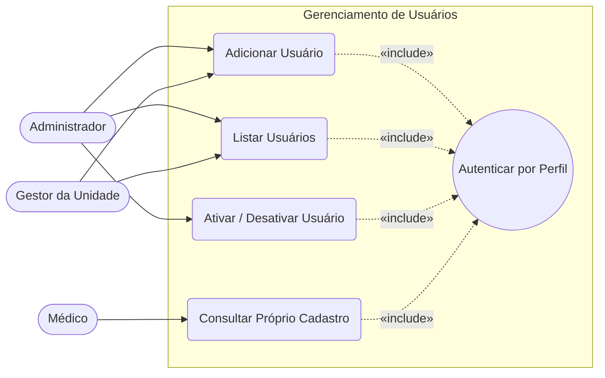
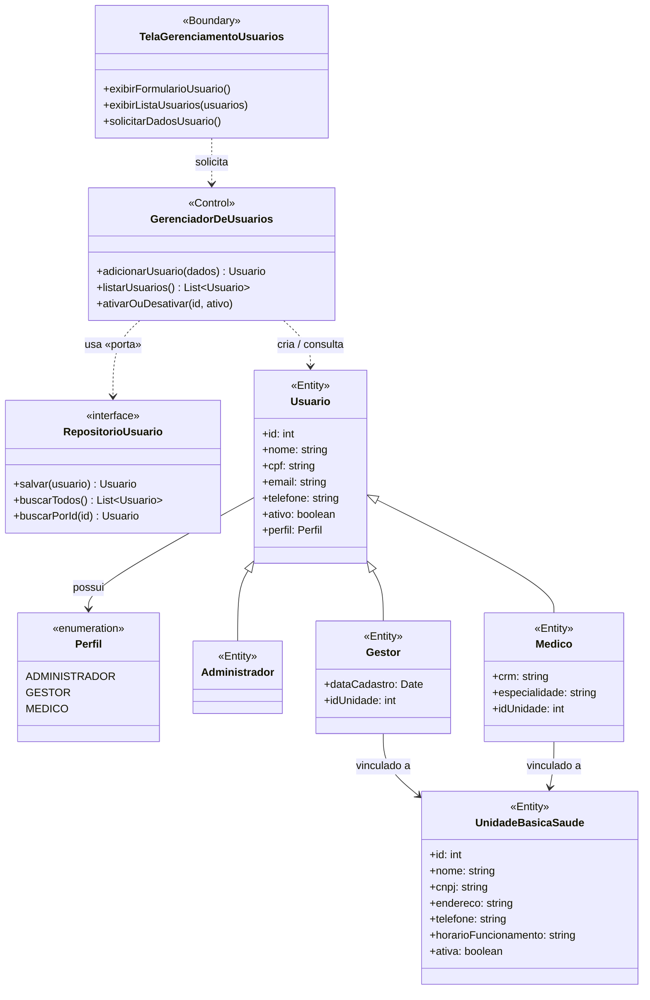

# Diagramas do Sistema — Gerenciamento de Usuários

**App Experimental de Triagem em Saúde**

Este documento concentra os diagramas do **contexto de Gerenciamento de Usuários**:
o cadastro e a administração dos perfis que operam o sistema — **Administrador**,
**Gestor da Unidade de Saúde** e **Médico**.

> O **Paciente** não é usuário do sistema (ver Documento de Requisitos, §2.4): seus dados
> são registrados pelo Médico no contexto de *Atendimento/Triagem*, que será diagramado
> em sprint própria. Por isso ele não aparece aqui.

Os diagramas estão alinhados aos requisitos **RF02** (gerenciar gestores e médicos),
**RF03** (autenticar por perfil) e **NF008** (controle de acesso por perfil), e à decisão
arquitetural [ADR-001 — Arquitetura Hexagonal](adr/ADR-001-arquitetura-hexagonal.md).

---

## 1. Diagrama de Casos de Uso

Atores e suas interações com o contexto de gerenciamento de usuários. Há três atores
(mínimo de dois atendido): **Administrador** e **Gestor** dirigem a gestão; o **Médico**
consulta o próprio cadastro.

> [!NOTE]
> **Hierarquia de permissões (NF008):**
> - **Administrador:** adiciona **Gestores** e os vincula a uma UBS; lista e ativa/desativa usuários no escopo global.
> - **Gestor:** adiciona **Médicos** dentro da **sua própria** unidade; lista os usuários da unidade.
> - **Médico:** consulta apenas o próprio cadastro.
>
> Toda ação de gestão exige **Autenticar por Perfil** («include»), garantindo que um perfil
> não acesse funções de outro.

**Foco da Sprint 1:** os casos de uso **Adicionar Usuário** e **Listar Usuários**.

---

## 2. Diagrama de Classe de Análise (ECB)

Padrão **ECB (Entity, Control, Boundary)**. A leitura em chave hexagonal (ADR-001):
a **Fronteira** é um *adaptador primário*, o **Controle** é o *núcleo / caso de uso*, as
**Entidades** são o *domínio*, e `RepositorioUsuario` é uma **porta secundária** — cujo
adaptador, na Sprint 1, é uma implementação em memória (RAM).

> [!NOTE]
> - `Usuario` é a **abstração comum** dos três perfis; `Perfil` distingue o tipo de acesso (RF03).
>   Isso permite **Adicionar** e **Listar** usuários de forma uniforme — o núcleo da Sprint 1.
> - `GerenciadorDeUsuarios` depende da **interface** `RepositorioUsuario`, nunca de uma
>   implementação concreta (Dependency Inversion, ADR-001). Trocar memória → banco real não
>   afeta o Controle.

---

## 3. Rastreabilidade

| Caso de uso              | Requisito        | Entrega    |
|--------------------------|------------------|------------|
| Autenticar por Perfil    | RF03 / NF008     | futura     |
| Adicionar Usuário        | RF02             | **Sprint 1** |
| Listar Usuários          | RF02             | **Sprint 1** |
| Ativar / Desativar Usuário | RF01 / RF02    | futura     |
| Consultar Próprio Cadastro | RF (UC Médico) | futura     |
