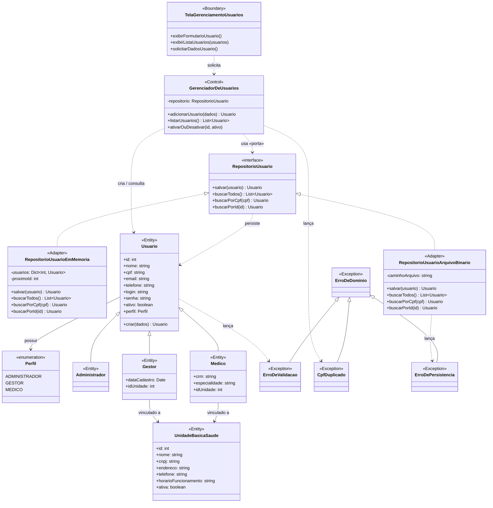
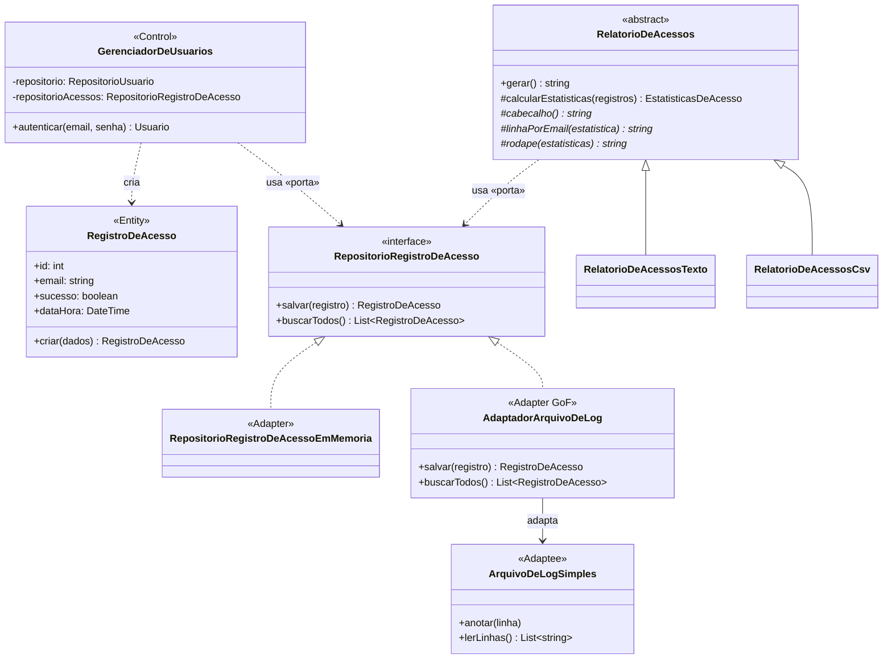

# Diagramas do Sistema — Gerenciamento de Usuários

**App Experimental de Triagem em Saúde**

Este documento concentra os diagramas do **contexto de Gerenciamento de Usuários**:
o cadastro e a administração dos perfis que operam o sistema — **Administrador**,
**Gestor da Unidade de Saúde** e **Médico**.

> O **Paciente** não é usuário do sistema (ver Documento de Requisitos, §2.4): seus dados
> são registrados pelo Médico no contexto de *Atendimento/Triagem*, que será diagramado
> em sprint própria. Por isso ele não aparece aqui.

Os diagramas estão alinhados aos requisitos **RF02** (gerenciar gestores e médicos),
**RF03** (autenticar por perfil) e **NF008** (controle de acesso por perfil), e à decisão
arquitetural [ADR-001 — Arquitetura Hexagonal](adr/ADR-001-arquitetura-hexagonal.md).

---

## 1. Diagrama de Casos de Uso

Atores e suas interações com o contexto de gerenciamento de usuários. Há três atores
(mínimo de dois atendido): **Administrador** e **Gestor** dirigem a gestão; o **Médico**
consulta o próprio cadastro.

> [!NOTE]
> **Hierarquia de permissões (NF008):**
> - **Administrador:** adiciona **Gestores** e os vincula a uma UBS; lista e ativa/desativa usuários no escopo global.
> - **Gestor:** adiciona **Médicos** dentro da **sua própria** unidade; lista os usuários da unidade.
> - **Médico:** consulta apenas o próprio cadastro.
>
> Toda ação de gestão exige **Autenticar por Perfil** («include»), garantindo que um perfil
> não acesse funções de outro.

**Foco da Sprint 1:** os casos de uso **Adicionar Usuário** e **Listar Usuários**.

---

## 2. Diagrama de Classe de Análise (ECB)

Padrão **ECB (Entity, Control, Boundary)**. A leitura em chave hexagonal (ADR-001):
a **Fronteira** é um *adaptador primário*, o **Controle** é o *núcleo / caso de uso*, as
**Entidades** são o *domínio*, e `RepositorioUsuario` é uma **porta secundária**.

Para o **Laboratório 2 — Tratamento de Erros**, o diagrama foi atualizado para incluir:

* os campos `login` e `senha` na entidade `Usuario`;
* validações de campos usando exceções;
* tratamento de CPF duplicado;
* tratamento de erro de persistência;
* dois mecanismos de persistência: memória RAM e arquivo binário;
* manutenção da arquitetura hexagonal, com o núcleo dependendo da porta `RepositorioUsuario`.

O arquivo PlantUML do diagrama está disponível em:
[`diagrama-classes.puml`](diagrama-classes.puml)

> [!NOTE]
>
> * `Usuario` é a **abstração comum** dos três perfis; `Perfil` distingue o tipo de acesso (RF03).
> * No Laboratório 2, `Usuario` passa a representar também os dados de autenticação `login` e `senha`.
> * As validações de `login`, `senha`, e demais campos obrigatórios são representadas por `ErroDeValidacao`.
> * `GerenciadorDeUsuarios` continua dependendo da **interface** `RepositorioUsuario`, nunca de uma implementação concreta.
> * `RepositorioUsuarioEmMemoria` e `RepositorioUsuarioArquivoBinario` são adaptadores intercambiáveis da mesma porta.
> * Falhas de leitura ou gravação no arquivo binário são representadas por `ErroDePersistencia`.

---

## 3. Tarefa 5 — Padrões Adapter e Template Method (estatísticas de acesso)

Cada tentativa de autenticação passa a ser registrada como `RegistroDeAcesso`
pela porta `RepositorioRegistroDeAcesso`, e os relatórios de estatísticas são
gerados por um **Template Method** que funciona sobre qualquer adaptador da
porta — inclusive o **Adapter** de arquivo de log.

> [!NOTE]
> **Adapter (GoF):** `AdaptadorArquivoDeLog` (Adapter) traduz `RegistroDeAcesso` de/para
> linhas de texto, permitindo que `ArquivoDeLogSimples` (Adaptee, interface incompatível)
> atenda à porta `RepositorioRegistroDeAcesso` (Target).
>
> **Template Method (GoF):** `RelatorioDeAcessos.gerar()` fixa o esqueleto do algoritmo
> (coletar → calcular estatísticas → cabeçalho/corpo/rodapé); as concretas implementam
> apenas os hooks de formatação (`*` = abstrato).

---

## 4. Rastreabilidade

| Caso de uso / item técnico      | Requisito / Laboratório  | Entrega          |
| ------------------------------- | ------------------------ | ---------------- |
| Autenticar por Perfil           | RF03 / NF008             | futura           |
| Adicionar Usuário               | RF02                     | Sprint 1 / Sprint 2 |
| Listar Usuários                 | RF02                     | Sprint 1         |
| Validar Login                   | Sprint 2                    | Sprint 2            |
| Validar Senha                   | Sprint 2 / Política AWS IAM | Sprint 2            |
| Tratar Erros de Validação       | Sprint 2                    | Sprint 2            |
| Persistência em Memória RAM     | ADR-002 / Sprint 2          | Sprint 1 / Sprint 2 |
| Persistência em Arquivo Binário | Sprint 2                    | Sprint 2            |
| Tratar Erros de Persistência    | Sprint 2                    | Sprint 2            |
| Ativar / Desativar Usuário      | RF01 / RF02              | futura           |
| Consultar Próprio Cadastro      | RF Médico                | futura           |
| Registrar Acessos (autenticação) | Tarefa 5 / NF011-C      | Tarefa 5         |
| Adapter de Log de Acessos       | Tarefa 5 (padrão Adapter) | Tarefa 5        |
| Relatórios de Estatísticas      | Tarefa 5 (Template Method) | Tarefa 5       |
