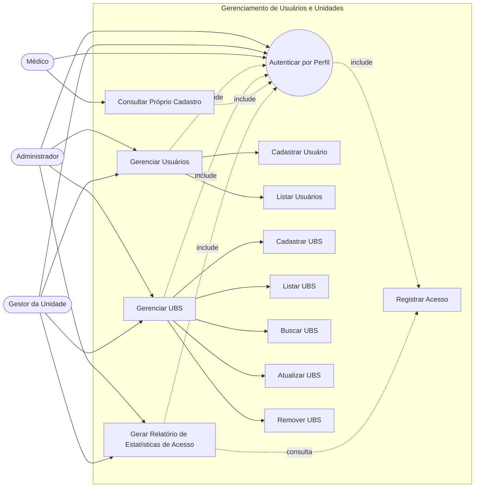
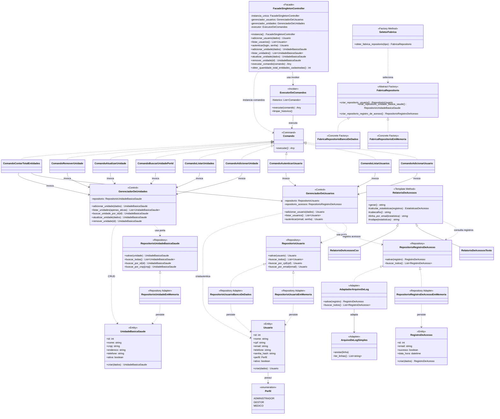
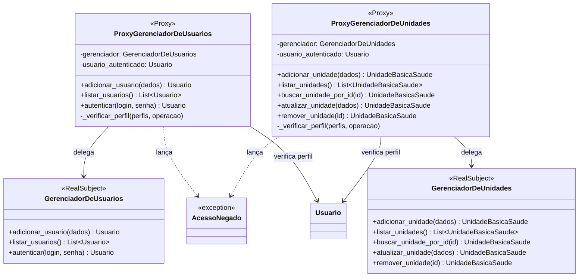
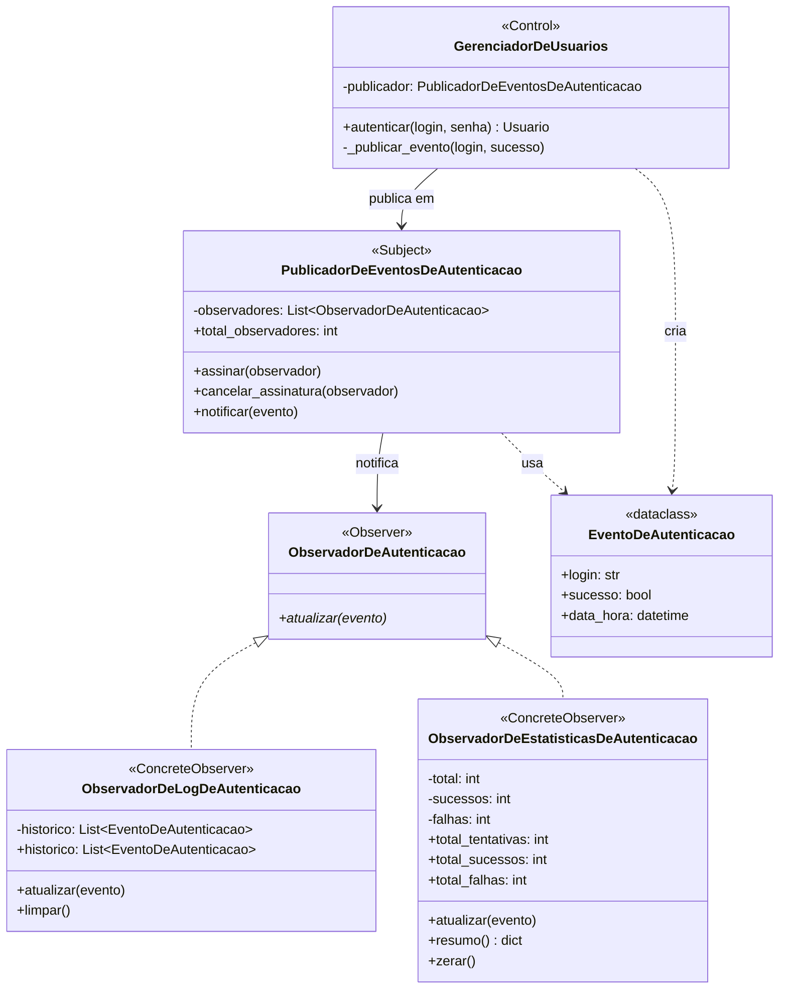

# Diagramas do Sistema — Gerenciamento de Usuários

**App Experimental de Triagem em Saúde**

Este documento concentra os diagramas do **contexto de Gerenciamento de Usuários**,
incluindo cadastro e autenticação de usuários, cadastro de Unidades Básicas de Saúde,
registro de acessos e geração de relatórios de estatísticas.

Os diagramas estão alinhados ao estado atual do projeto até a **Sprint 4**, contemplando:

- autenticação por perfil;
- CRUD de `Usuario`;
- CRUD de `UnidadeBasicaSaude`;
- registro de acessos dos usuários;
- relatórios de estatísticas de acesso;
- separação entre business e persistência por Repository;
- padrões Factory Method, Abstract Factory, Adapter, Template Method, Facade, Singleton e Command.

> O **Paciente** e o módulo de triagem clínica aparecem no escopo geral do produto,
> mas ainda não fazem parte deste contexto implementado no backend até a Sprint 4.

---

## 1. Descrição dos 3 casos de uso mais relevantes

### UC01 — Autenticar usuário

| Campo | Descrição |
| ----- | --------- |
| Atores principais | Administrador, Gestor da Unidade, Médico |
| Objetivo | Permitir que um usuário acesse o sistema por meio de login e senha, recebendo as permissões correspondentes ao seu perfil. |
| Pré-condições | O usuário deve estar cadastrado e ativo. |
| Pós-condições | O acesso é autorizado ou recusado e a tentativa é registrada para fins de auditoria e estatísticas. |
| Requisitos relacionados | RF03 — Autenticar usuários; NF008 — Controle de acesso por perfil. |

**Fluxo principal**

1. O usuário informa login e senha.
2. O sistema valida se os campos obrigatórios foram preenchidos.
3. O sistema consulta o usuário pelo login.
4. O sistema verifica a senha utilizando o hash armazenado.
5. O sistema verifica se o usuário está ativo.
6. O sistema registra a tentativa como `RegistroDeAcesso`.
7. O sistema libera o acesso conforme o perfil do usuário.

**Fluxos alternativos**

- Login inexistente ou senha incorreta: o sistema lança `CredenciaisInvalidas`.
- Usuário inativo: o sistema lança `UsuarioInativo`.
- Login ou senha ausentes: o sistema lança `ErroDeValidacao`.

### UC02 — Gerenciar usuários

| Campo | Descrição |
| ----- | --------- |
| Atores principais | Administrador, Gestor da Unidade |
| Objetivo | Cadastrar e consultar usuários que operam o sistema. |
| Pré-condições | O ator deve estar autenticado e possuir perfil autorizado. |
| Pós-condições | O usuário é cadastrado ou listado conforme as regras de domínio. |
| Requisitos relacionados | RF02 — Gerenciar gestores e médicos; RF03 — Autenticar usuários; NF008 — Controle de acesso por perfil. |

**Fluxo principal**

1. O ator solicita o cadastro de um novo usuário.
2. O sistema recebe nome, CPF, e-mail, telefone, login, senha e perfil.
3. O sistema valida os dados informados.
4. O sistema verifica se o CPF já está cadastrado.
5. O sistema verifica se o login já está cadastrado.
6. O sistema cria a entidade `Usuario`.
7. A senha é armazenada somente na forma de hash.
8. O sistema persiste o usuário por meio da porta `RepositorioUsuario`.
9. O sistema permite listar os usuários cadastrados.

**Fluxos alternativos**

- CPF já cadastrado: o sistema lança `CpfDuplicado`.
- Login já cadastrado: o sistema lança `LoginDuplicado`.
- Dados inválidos: o sistema lança `ErroDeValidacao`.
- Falha de persistência: o sistema lança a exceção correspondente.

### UC03 — Gerenciar Unidades Básicas de Saúde

| Campo | Descrição |
| ----- | --------- |
| Atores principais | Administrador, Gestor da Unidade |
| Objetivo | Realizar o CRUD de Unidades Básicas de Saúde. |
| Pré-condições | O ator deve estar autenticado e possuir permissão para gerenciar unidades. |
| Pós-condições | A unidade é cadastrada, consultada, atualizada ou removida logicamente. |
| Requisitos relacionados | Sprint 3 — CRUD de nova entidade relacionada ao domínio do projeto. |

**Fluxo principal**

1. O ator solicita o cadastro de uma Unidade Básica de Saúde.
2. O sistema recebe nome, CNPJ, endereço e telefone.
3. O sistema valida os campos obrigatórios e o formato do CNPJ.
4. O sistema verifica se já existe unidade com o mesmo CNPJ.
5. O sistema cria a entidade `UnidadeBasicaSaude`.
6. O sistema persiste a unidade por meio da porta `RepositorioUnidadeBasicaSaude`.
7. O sistema permite listar, buscar, atualizar e remover logicamente a unidade.

**Fluxos alternativos**

- CNPJ já cadastrado: o sistema lança `CnpjDuplicado`.
- Unidade inexistente: o sistema lança `UnidadeNaoEncontrada`.
- Remoção: a unidade não é apagada fisicamente; ela é marcada como inativa.

---

## 2. Regras de negócio do usuário

As principais regras atualmente implementadas são:

- **RN01 — Login obrigatório:** todo usuário deve possuir login.
- **RN02 — Tamanho do login:** o login deve possuir no máximo 12 caracteres.
- **RN03 — Login único:** dois usuários não podem possuir o mesmo login.
- **RN04 — Autenticação:** a autenticação utiliza login e senha.
- **RN05 — E-mail válido:** o e-mail cadastrado deve possuir formato válido.
- **RN06 — Tamanho da senha:** a senha deve possuir entre 8 e 128 caracteres.
- **RN07 — Complexidade da senha:** a senha deve possuir pelo menos três entre os quatro grupos: letras maiúsculas, letras minúsculas, números e caracteres especiais.
- **RN08 — Senha e dados pessoais:** a senha não pode ser igual ao nome ou ao e-mail.
- **RN09 — Perfil:** o usuário deve possuir perfil Administrador, Gestor ou Médico.

## 3. Diagrama de Casos de Uso

O diagrama abaixo representa os casos de uso contemplados no contexto de gerenciamento
até a Sprint 4: autenticação, gerenciamento de usuários, gerenciamento de UBS,
registro de acessos e geração de relatórios.

> **Observação:** o diagrama considera o contexto implementado até a Sprint 4.
> Funcionalidades futuras do produto, como triagem clínica, pacientes e IA, devem ser
> modeladas em diagramas próprios quando forem incorporadas ao backend.

---

## 4. Diagrama de Classe de Análise até a Sprint 4

Este diagrama substitui a visão antiga do Laboratório 2 e representa o estado atual
do projeto até a Sprint 4. Ele contempla:

- CRUD de `Usuario`;
- CRUD de `UnidadeBasicaSaude`;
- entidade `RegistroDeAcesso`;
- padrão **Repository** para separar business e persistência;
- **Factory Method** e **Abstract Factory** para seleção/criação de repositórios;
- **Adapter** para adaptar o arquivo de log à porta de registro de acessos;
- **Template Method** para relatórios de estatísticas de acesso;
- **Facade** e **Singleton** no controller/fachada principal.

---

## 4. Sprint 3 — Padrões Facade + Singleton e CRUD de Unidade Básica de Saúde

A Sprint 3 introduziu o cadastro completo da entidade `UnidadeBasicaSaude`,
incluindo criação, listagem, busca por id, atualização e remoção lógica.

Também foi criada a `FacadeSingletonController`, que funciona como:

- **Facade:** centraliza o acesso aos gerenciadores de usuários e unidades;
- **Singleton:** disponibiliza uma única instância principal da fachada;
- **ponto de contagem:** expõe `obter_quantidade_total_entidades_cadastradas()`.

O arquivo PlantUML específico da Sprint 3 está disponível em:

[`diagrama-classes-v2.puml`](diagrama-classes-v2.puml)

---

## 6. Sprint 4 — Diagrama Final de Padrões de Projeto

A Sprint 4 consolida a separação entre a camada de negócio (`aplicacao` e `dominio`)
e a camada de persistência/infraestrutura (`portas` e `adaptadores`).

O arquivo PlantUML do diagrama final está disponível em:

[`diagrama-classes-final-sprint4.puml`](diagrama-classes-final-sprint4.puml)

| Padrão | Onde aparece no projeto |
| ------ | ------------------------ |
| Repository | `RepositorioUsuario`, `RepositorioUnidadeBasicaSaude`, `RepositorioRegistroDeAcesso` |
| Factory Method | `obter_fabrica_repositorio()` em `seletor_fabrica.py` |
| Abstract Factory | `FabricaRepositorio`, `FabricaRepositorioEmMemoria`, `FabricaRepositorioBancoDeDados` |
| Adapter | `AdaptadorArquivoDeLog`, adaptando `ArquivoDeLogSimples` para `RepositorioRegistroDeAcesso` |
| Template Method | `RelatorioDeAcessos.gerar()` com `RelatorioDeAcessosTexto` e `RelatorioDeAcessosCsv` |
| Facade | `FacadeSingletonController` |
| Singleton | `FacadeSingletonController.instancia()` |
| Command | `Comando`, `ExecutorDeComandos`, comandos em `gestao_usuarios.aplicacao.comandos` e `FacadeSingletonController` |

---

## 7. Sprint 5 — Padrão Command

A Sprint 5 refatora a camada de aplicação para integrar o padrão **Command (GoF)**, desacoplando a fachada (`FacadeSingletonController` / `FacadeDoSistema`) dos gerenciadores (`GerenciadorDeUsuarios` e `GerenciadorDeUnidades`) e centralizando o disparo das operações de negócio no `ExecutorDeComandos`.

### Padrão Command

*Classes participantes:* `Comando`, `ComandoAdicionarUsuario`, `ComandoListarUsuarios`, `ComandoAutenticarUsuario`, `ComandoAdicionarUnidade`, `ComandoListarUnidades`, `ComandoBuscarUnidadePorId`, `ComandoAtualizarUnidade`, `ComandoRemoverUnidade`, `ComandoContarTotalEntidades`, `ExecutorDeComandos` e `FacadeSingletonController` (`FacadeDoSistema`).

*Objetivo:* encapsular as operações da camada de negócio como objetos, reduzindo o acoplamento entre a fachada e os gerenciadores e permitindo organizar a execução das ações do sistema.

---

## 8. Sprint 6 — Padrões Proxy e Observer

A Sprint 6 introduz dois novos padrões GoF na camada de aplicação:

- **Proxy** — autorização por perfil antes de cada operação;
- **Observer** — publicação/notificação de eventos de autenticação para log e estatísticas.

---

### Padrão Proxy — Autorização por Perfil

*Classes participantes:* `ProxyGerenciadorDeUsuarios`, `ProxyGerenciadorDeUnidades`, `GerenciadorDeUsuarios` (RealSubject), `GerenciadorDeUnidades` (RealSubject), `AcessoNegado`.

*Objetivo:* interpor uma camada de verificação de perfil entre o chamador e os gerenciadores reais. O cliente recebe um Proxy em vez do gerenciador direto; o Proxy verifica o perfil do usuário autenticado e, se autorizado, delega ao objeto real. Caso contrário, lança `AcessoNegado` sem nunca alcançar o gerenciador.

#### Matriz de Permissões

| Operação | ADMINISTRADOR | GESTOR | MÉDICO |
|---|:---:|:---:|:---:|
| `adicionar_usuario` | ✅ | ❌ | ❌ |
| `listar_usuarios` | ✅ | ✅ | ❌ |
| `autenticar` | ✅ | ✅ | ✅ |
| `adicionar_unidade` | ✅ | ✅ | ❌ |
| `listar_unidades` | ✅ | ✅ | ✅ |
| `buscar_unidade_por_id` | ✅ | ✅ | ✅ |
| `atualizar_unidade` | ✅ | ✅ | ❌ |
| `remover_unidade` | ✅ | ❌ | ❌ |

#### Diagrama de Classes — Proxy

---

### Padrão Observer — Eventos de Autenticação

*Classes participantes:* `PublicadorDeEventosDeAutenticacao` (Subject), `ObservadorDeAutenticacao` (Observer/ABC), `ObservadorDeLogDeAutenticacao`, `ObservadorDeEstatisticasDeAutenticacao` (Concrete Observers), `EventoDeAutenticacao` (objeto de dados).

*Objetivo:* desacoplar o `GerenciadorDeUsuarios` dos seus interessados em eventos de autenticação. A cada tentativa de login (sucesso ou falha), o gerenciador publica um `EventoDeAutenticacao` no publicador; o publicador despacha o evento para todos os observadores inscritos sem que o gerenciador precise conhecê-los.

#### Diagrama de Classes — Observer

---

## 9. Rastreabilidade

| Caso de uso / item técnico | Requisito / Laboratório | Entrega |
| -------------------------- | ------------------------ | ------- |
| Autenticar por Perfil | RF03 / NF008 | Sprint 2 / Sprint 4 |
| Adicionar Usuário | RF02 | Sprint 1 / Sprint 2 |
| Listar Usuários | RF02 | Sprint 1 |
| Validar Login | Sprint 2 | Sprint 2 |
| Validar Senha com hash | Sprint 2 / NF007 | Sprint 2 / Sprint 4 |
| Tratar Erros de Validação | Sprint 2 | Sprint 2 |
| Persistência em Memória RAM | ADR-002 / Repository | Sprint 1 / Sprint 2 / Sprint 4 |
| Persistência em SQLite | Repository / Banco de Dados | Sprint 4 |
| Registro de Acessos | Estatísticas de autenticação | Sprint 4 |
| Adapter de Log de Acessos | Sprint 4 (Adapter) | Sprint 4 |
| Relatórios de Estatísticas | Sprint 4 (Template Method) | Sprint 4 |
| CRUD Unidade Básica de Saúde | Sprint 3 (nova entidade) | Sprint 3 |
| Facade + Singleton Controller | Sprint 3 (Padrões GoF) | Sprint 3 |
| Contagem total de entidades | Sprint 3 (método Facade) | Sprint 3 |
| Repository para entidades | Sprint 4 (Repository) | Sprint 4 |
| Factory Method / Abstract Factory | Sprint 4 (Factory) | Sprint 4 |
| Diagrama de casos de uso atualizado | Casos de uso até Sprint 4 | Sprint 4 |
| Diagrama de classe de análise atualizado | Classe de análise até Sprint 4 | Sprint 4 |
| Diagrama final de padrões | Sprint 4 (diagrama final) | Sprint 4 |
| Command Pattern (Facade + Executor) | Sprint 5 (Command) | Sprint 5 |
| **Proxy — Autorização por Perfil** | **Sprint 6 (Proxy)** | **Sprint 6** |
| **Observer — Eventos de Autenticação** | **Sprint 6 (Observer)** | **Sprint 6** |
| **Matriz de Permissões** | **Sprint 6 (Proxy)** | **Sprint 6** |

---

## 10. Complemento — Casos de uso e diagrama de análise até Sprint 4

A documentação complementar com a descrição dos três casos de uso mais relevantes,
o diagrama de casos de uso atualizado e o diagrama de classe de análise até a
Sprint 4 está disponível em:

[Complemento de Documentação — Sprint 4](complemento-sprint4-casos-uso-e-analise.md)

