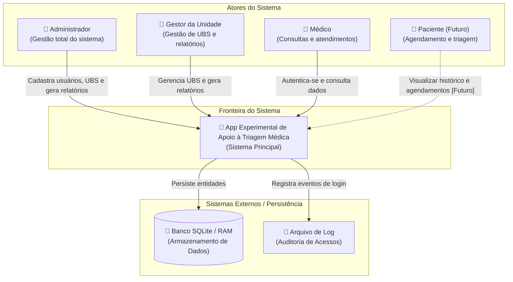
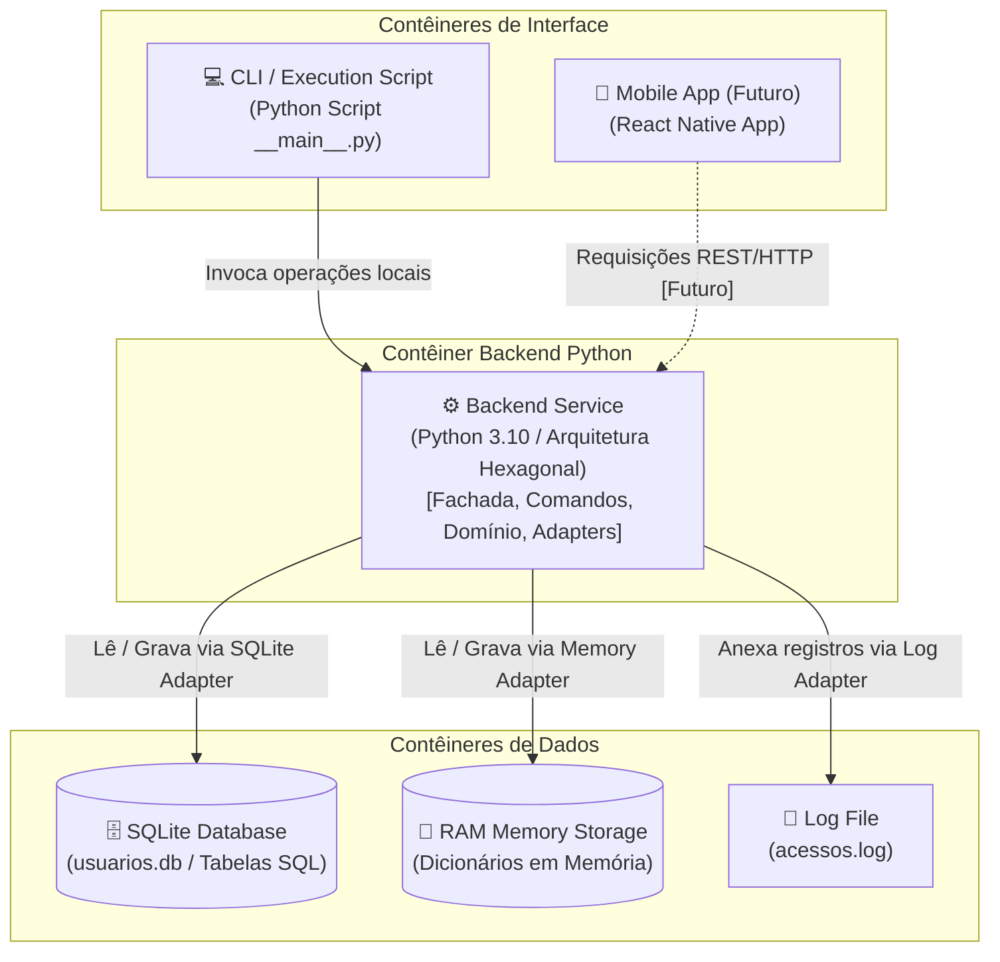
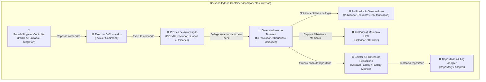

# Diagramas do Sistema — Modelo C4 e Padrões de Projeto Coloridos

**App Experimental de Triagem em Saúde**

Este documento contempla a especificação completa da arquitetura do **App Experimental de Apoio à Triagem Médica**, utilizando o **Modelo C4** em 4 níveis de detalhamento (Contexto, Contêineres, Componentes e Código) e a identificação visual dos 11 **Padrões de Projeto GoF** através de códigos de cores.

---

## 🎨 Mapeamento de Padrões de Projeto por Cores

A tabela abaixo define os 11 padrões de projeto integrados ao backend, categorizados por tipo (Criacional, Estrutural, Comportamental), cor atribuída nos diagramas visualizáveis, classes participantes e objetivo principal no sistema.

| Padrão GoF | Categoria | Cor / Badge | Classes e Interfaces Participantes | Objetivo no Sistema |
| :--- | :--- | :--- | :--- | :--- |
| **Facade** | Estrutural | `LightBlue` `#ADD8E6` | `FacadeSingletonController` (FacadeDoSistema) | Centralizar o acesso simplificado a todas as operações de negócio para os clientes da aplicação. |
| **Singleton** | Criacional | `DeepSkyBlue` `#00BFFF` | `FacadeSingletonController` | Garantir que exista uma única instância global acessível da Fachada durante o ciclo de vida do sistema. |
| **Command** | Comportamental | `LightGreen` `#90EE90` | `Comando`, `ExecutorDeComandos`, `ComandoAdicionarUsuario`, `ComandoAtualizarUnidade`, `ComandoDesfazerAtualizacaoDeUnidade`, etc. | Desacoplar a requisição do usuário de sua execução real, encapsulando cada operação em um objeto executável por um Invoker central. |
| **Memento** | Comportamental | `PeachPuff` `#FFDAB9` | `UnidadeBasicaSaude` (Originator), `MementoUnidadeBasicaSaude` (Memento), `HistoricoDeUnidade` (Caretaker) | Capturar e restaurar o estado anterior da última atualização bem-sucedida de uma UBS sem violar o encapsulamento. |
| **Proxy** | Estrutural | `LightCoral` `#F08080` | `ProxyGerenciadorDeUsuarios`, `ProxyGerenciadorDeUnidades`, `AcessoNegado` | Interceptar chamadas de métodos nos gerenciadores para aplicar autorização baseada em perfil de acesso (RBAC). |
| **Observer** | Comportamental | `Plum` `#DDA0DD` | `PublicadorDeEventosDeAutenticacao` (Subject), `ObservadorDeAutenticacao` (Observer), `ObservadorDeLogDeAutenticacao`, `ObservadorDeEstatisticasDeAutenticacao` | Disparar e notificar eventos de login (sucesso/falha) para múltiplos módulos de auditoria de forma desacoplada. |
| **Repository** | Estrutural | `LightCyan` `#E0FFFF` | `RepositorioUsuario`, `RepositorioUnidadeBasicaSaude`, `RepositorioRegistroDeAcesso` | Abstrair o acesso e a persistência de dados de domínio mantendo a independência de mecanismos de armazenamento. |
| **Factory Method** | Criacional | `Khaki` `#F0E68C` | `SeletorFabrica` | Decidir dinamicamente qual fábrica concreta instanciar com base na configuração do sistema. |
| **Abstract Factory** | Criacional | `Moccasin` `#FFE4B5` | `FabricaRepositorio`, `FabricaRepositorioEmMemoria`, `FabricaRepositorioBancoDeDados` | Fornecer uma interface para criar famílias de repositórios compatíveis (RAM vs SQLite). |
| **Adapter** | Estrutural | `LightPink` `#FFB6C1` | `AdaptadorArquivoDeLog`, `ArquivoDeLogSimples` | Converter a interface legada de escrita em arquivos de log para a porta `RepositorioRegistroDeAcesso`. |
| **Template Method** | Comportamental | `Wheat` `#F5DEB3` | `RelatorioDeAcessos`, `RelatorioDeAcessosTexto`, `RelatorioDeAcessosCsv` | Definir o esqueleto do algoritmo de geração de relatório de acessos, delegando a formatação do cabeçalho, linhas e rodapé para as subclasses. |

---

## 🏛️ Modelo C4 de Arquitetura

O modelo C4 organiza a arquitetura do sistema em 4 níveis de abstração progressiva:

```text
Nível 1: Contexto      ---> Visão geral das pessoas (atores) e do sistema em seu ecossistema.
Nível 2: Contêineres   ---> Visão das grandes partes tecnológicas executáveis (backend, banco, log).
Nível 3: Componentes   ---> Visão dos blocos lógicos internos do backend Python.
Nível 4: Código        ---> Diagrama de classes detalhado com identificação de padrões por cores.
```

---

### C4 — Nível 1: Diagrama de Contexto

O diagrama de contexto apresenta os atores que interagem com o sistema e os limites externos.



---

### C4 — Nível 2: Diagrama de Contêineres

O diagrama de contêineres mostra as escolhas tecnológicas e como cada contêiner se comunica.



---

### C4 — Nível 3: Diagrama de Componentes

O diagrama de componentes detalha a organização interna do **Backend Service (Python)**.



---

### C4 — Nível 4: Diagrama de Código (Classes e Padrões Coloridos)

O diagrama abaixo representa o nível de código do sistema, com caixas de estilo identificando visualmente cada padrão GoF.

```mermaid
classDiagram
    %% Estilos de Cores dos Padrões
    style FacadeSingletonController fill:#ADD8E6,stroke:#333,stroke-width:2px
    style Comando fill:#90EE90,stroke:#333,stroke-width:1px
    style ExecutorDeComandos fill:#90EE90,stroke:#333,stroke-width:2px
    style ComandoAdicionarUsuario fill:#90EE90,stroke:#333,stroke-width:1px
    style ComandoAtualizarUnidade fill:#90EE90,stroke:#333,stroke-width:1px
    style ComandoDesfazerAtualizacaoDeUnidade fill:#90EE90,stroke:#333,stroke-width:1px
    style MementoUnidadeBasicaSaude fill:#FFDAB9,stroke:#333,stroke-width:2px
    style HistoricoDeUnidade fill:#FFDAB9,stroke:#333,stroke-width:2px
    style ProxyGerenciadorDeUsuarios fill:#F08080,stroke:#333,stroke-width:2px
    style ProxyGerenciadorDeUnidades fill:#F08080,stroke:#333,stroke-width:2px
    style PublicadorDeEventosDeAutenticacao fill:#DDA0DD,stroke:#333,stroke-width:2px
    style ObservadorDeAutenticacao fill:#DDA0DD,stroke:#333,stroke-width:1px
    style ObservadorDeLogDeAutenticacao fill:#DDA0DD,stroke:#333,stroke-width:1px
    style ObservadorDeEstatisticasDeAutenticacao fill:#DDA0DD,stroke:#333,stroke-width:1px
    style RepositorioUsuario fill:#E0FFFF,stroke:#333,stroke-width:1px
    style RepositorioUnidadeBasicaSaude fill:#E0FFFF,stroke:#333,stroke-width:1px
    style RepositorioRegistroDeAcesso fill:#E0FFFF,stroke:#333,stroke-width:1px
    style SeletorFabrica fill:#F0E68C,stroke:#333,stroke-width:2px
    style FabricaRepositorio fill:#FFE4B5,stroke:#333,stroke-width:1px
    style FabricaRepositorioEmMemoria fill:#FFE4B5,stroke:#333,stroke-width:1px
    style FabricaRepositorioBancoDeDados fill:#FFE4B5,stroke:#333,stroke-width:1px
    style AdaptadorArquivoDeLog fill:#FFB6C1,stroke:#333,stroke-width:2px
    style ArquivoDeLogSimples fill:#FFB6C1,stroke:#333,stroke-width:1px
    style RelatorioDeAcessos fill:#F5DEB3,stroke:#333,stroke-width:2px
    style RelatorioDeAcessosTexto fill:#F5DEB3,stroke:#333,stroke-width:1px
    style RelatorioDeAcessosCsv fill:#F5DEB3,stroke:#333,stroke-width:1px

    %% Classes de Domínio
    class Usuario {
        +int id
        +string nome
        +string cpf
        +string email
        +string login
        +string senha_hash
        +Perfil perfil
        +bool ativo
    }

    class UnidadeBasicaSaude {
        +int id
        +string nome
        +string cnpj
        +string endereco
        +string telefone
        +bool ativa
        +criar_memento() MementoUnidadeBasicaSaude
        +restaurar(memento)
    }

    class MementoUnidadeBasicaSaude {
        +int id
        +string nome
        +string cnpj
        +string endereco
        +string telefone
        +bool ativa
    }

    class HistoricoDeUnidade {
        -MementoUnidadeBasicaSaude ultimo
        +salvar(memento)
        +obter_ultimo() MementoUnidadeBasicaSaude
        +descartar_ultimo()
    }

    %% Fachada e Singleton
    class FacadeSingletonController {
        -FacadeSingletonController instancia_unica
        -ExecutorDeComandos executor
        +instancia() FacadeSingletonController
        +adicionar_usuario(dados)
        +desfazer_ultima_atualizacao_de_unidade()
        +obter_quantidade_total_entidades_cadastradas() int
    }

    %% Command
    class Comando {
        <<interface>>
        +executar()*
    }
    class ExecutorDeComandos {
        -List~Comando~ historico
        +executar(comando)
    }
    class ComandoAdicionarUsuario
    class ComandoAtualizarUnidade
    class ComandoDesfazerAtualizacaoDeUnidade

    Comando <|.. ComandoAdicionarUsuario
    Comando <|.. ComandoAtualizarUnidade
    Comando <|.. ComandoDesfazerAtualizacaoDeUnidade

    %% Proxy
    class ProxyGerenciadorDeUsuarios {
        -GerenciadorDeUsuarios gerenciador
        -Usuario usuario_autenticado
        +adicionar_usuario(dados)
        -_verificar_perfil(perfis, operacao)
    }
    class ProxyGerenciadorDeUnidades {
        -GerenciadorDeUnidades gerenciador
        -Usuario usuario_autenticado
        +atualizar_unidade(dados)
        -_verificar_perfil(perfis, operacao)
    }

    %% Observer
    class PublicadorDeEventosDeAutenticacao {
        -List~ObservadorDeAutenticacao~ observadores
        +assinar(observador)
        +notificar(evento)
    }
    class ObservadorDeAutenticacao {
        <<interface>>
        +atualizar(evento)*
    }
    class ObservadorDeLogDeAutenticacao
    class ObservadorDeEstatisticasDeAutenticacao

    ObservadorDeAutenticacao <|.. ObservadorDeLogDeAutenticacao
    ObservadorDeAutenticacao <|.. ObservadorDeEstatisticasDeAutenticacao
    PublicadorDeEventosDeAutenticacao --> ObservadorDeAutenticacao : notifica

    %% Repositories e Abstract Factory
    class RepositorioUsuario {
        <<interface>>
        +salvar(usuario)
        +buscar_por_id(id)
    }
    class FabricaRepositorio {
        <<interface>>
        +criar_repositorio_usuario()
    }
    class SeletorFabrica {
        +obter_fabrica_repositorio(tipo) FabricaRepositorio
    }

    %% Adapter
    class AdaptadorArquivoDeLog {
        -ArquivoDeLogSimples arquivo_log
        +salvar(registro)
    }
    class ArquivoDeLogSimples

    AdaptadorArquivoDeLog --> ArquivoDeLogSimples : adapta

    %% Template Method
    class RelatorioDeAcessos {
        <<abstract>>
        +gerar() string
        #cabecalho()*
        #linha_por_email(estatistica)*
        #rodape(estatisticas)*
    }
    class RelatorioDeAcessosTexto
    class RelatorioDeAcessosCsv

    RelatorioDeAcessos <|-- RelatorioDeAcessosTexto
    RelatorioDeAcessos <|-- RelatorioDeAcessosCsv

    %% Relações da Fachada e Executores
    FacadeSingletonController --> ExecutorDeComandos : usa
    ExecutorDeComandos --> Comando : executa
    ComandoAdicionarUsuario --> ProxyGerenciadorDeUsuarios : invoca
    UnidadeBasicaSaude ..> MementoUnidadeBasicaSaude : cria/restaura
    HistoricoDeUnidade --> MementoUnidadeBasicaSaude : guarda
```



---

## 📋 Descrição dos Casos de Uso Principais

### UC01 — Autenticar Usuário
- **Atores:** Administrador, Gestor da Unidade, Médico.
- **Objetivo:** Autenticar um usuário por `login` e `senha` e emitir os eventos de auditoria.
- **Pré-condições:** Usuário cadastrado e ativo.
- **Pós-condições:** Acesso concedido ou exceção lançada; evento publicado para `ObservadorDeLogDeAutenticacao` e `ObservadorDeEstatisticasDeAutenticacao`.

### UC02 — Gerenciar Usuários
- **Atores:** Administrador (escrita) e Gestor (consulta).
- **Objetivo:** Cadastrar, listar, buscar por ID/login, atualizar e desativar/reativar usuários logicamente.
- **Validações:** Login sem números, tamanho máximo de 12 caracteres, senha conforme regras IAM, CPF único.

### UC03 — Gerenciar Unidades Básicas de Saúde
- **Atores:** Administrador e Gestor da Unidade.
- **Objetivo:** Realizar operações CRUD em UBS e permitir restaurar o estado anterior.

### UC04 — Desfazer Última Atualização de UBS
- **Atores:** Administrador e Gestor da Unidade.
- **Objetivo:** Restaurar o estado anterior exato da UBS modificada na última operação de atualização bem-sucedida por meio do padrão **Memento**.

### UC05 — Registrar e Relatar Acessos
- **Atores:** Administrador e Gestor da Unidade.
- **Objetivo:** Gravar logs de tentativa de autenticação e gerar relatórios estatísticos formatados (Texto ou CSV) via **Template Method**.
