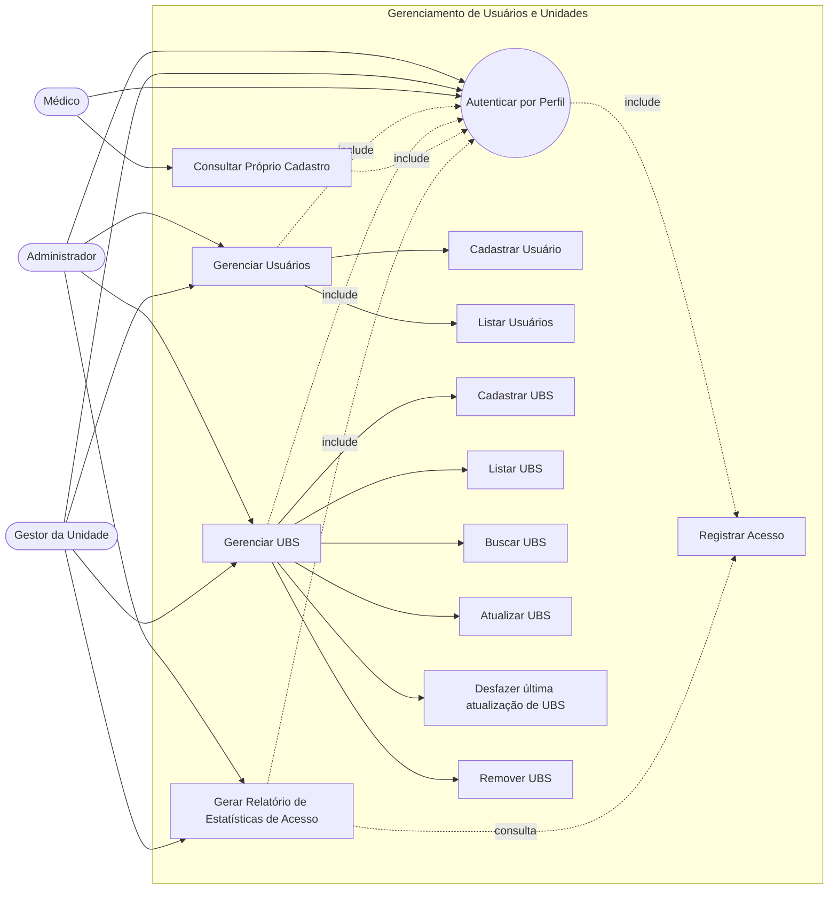

# Diagramas do Sistema — Gerenciamento de Usuários

**App Experimental de Triagem em Saúde**

Este documento concentra os diagramas do **contexto de Gerenciamento de Usuários**,
incluindo cadastro e autenticação de usuários, cadastro de Unidades Básicas de Saúde,
registro de acessos, geração de relatórios de estatísticas e restauração da última
atualização de uma UBS.

Os diagramas estão alinhados ao estado atual do projeto até a **Sprint 7**, contemplando:

- autenticação por perfil;
- CRUD completo de `Usuario`, incluindo busca, atualização e desativação lógica;
- CRUD de `UnidadeBasicaSaude`;
- registro de acessos dos usuários;
- relatórios de estatísticas de acesso;
- separação entre negócio e persistência por Repository;
- padrões Factory Method, Abstract Factory, Adapter, Template Method, Facade,
  Singleton, Command e Memento;
- desfazer da última atualização bem-sucedida de uma Unidade Básica de Saúde;
- validação de login e de senha por meio de exceções de domínio;
- persistência do CRUD de usuários nos dois mecanismos disponíveis (RAM e SQLite).

> O **Paciente** e o módulo de triagem clínica aparecem no escopo geral do produto,
> mas ainda não fazem parte deste contexto implementado no backend até a Sprint 7.

---

## 1. Descrição dos 3 casos de uso mais relevantes

### UC01 — Autenticar usuário

| Campo | Descrição |
| ----- | --------- |
| Atores principais | Administrador, Gestor da Unidade, Médico |
| Objetivo | Permitir que um usuário acesse o sistema por meio de login e senha, recebendo as permissões correspondentes ao seu perfil. |
| Pré-condições | O usuário deve estar cadastrado e ativo. |
| Pós-condições | O acesso é autorizado ou recusado e a tentativa é registrada para fins de auditoria e estatísticas. |
| Requisitos relacionados | RF03 — Autenticar usuários; NF008 — Controle de acesso por perfil. |

**Fluxo principal**

1. O usuário informa login e senha.
2. O sistema valida se os campos obrigatórios foram preenchidos.
3. O sistema consulta o usuário pelo login.
4. O sistema verifica a senha utilizando o hash armazenado.
5. O sistema verifica se o usuário está ativo.
6. O sistema registra a tentativa como `RegistroDeAcesso`.
7. O sistema libera o acesso conforme o perfil do usuário.

**Fluxos alternativos**

- Login inexistente ou senha incorreta: o sistema lança `CredenciaisInvalidas`.
- Usuário inativo: o sistema lança `UsuarioInativo`.
- Login ou senha ausentes: o sistema lança `ErroDeValidacao`.

### UC02 — Gerenciar usuários

| Campo | Descrição |
| ----- | --------- |
| Atores principais | Administrador, Gestor da Unidade |
| Objetivo | Cadastrar, consultar, atualizar e desativar os usuários que operam o sistema. |
| Pré-condições | O ator deve estar autenticado e possuir perfil autorizado. |
| Pós-condições | O usuário é cadastrado, listado, consultado, atualizado ou desativado conforme as regras de domínio. |
| Requisitos relacionados | RF02 — Gerenciar gestores e médicos; RF03 — Autenticar usuários; NF008 — Controle de acesso por perfil; Sprint 2 — validação de campos com exceções. |

**Fluxo principal**

1. O ator solicita o cadastro de um novo usuário.
2. O sistema recebe nome, CPF, e-mail, telefone, login, senha e perfil.
3. O sistema valida os dados informados.
4. O sistema verifica se o CPF já está cadastrado.
5. O sistema verifica se o login já está cadastrado.
6. O sistema cria a entidade `Usuario`.
7. A senha é armazenada somente na forma de hash.
8. O sistema persiste o usuário por meio da porta `RepositorioUsuario`.
9. O sistema permite listar os usuários cadastrados, opcionalmente apenas os ativos.
10. O sistema permite buscar um usuário pelo identificador ou pelo login.
11. O sistema permite atualizar os dados cadastrais de um usuário existente,
    revalidando todas as regras antes de persistir.
12. O sistema permite desativar logicamente um usuário, preservando o cadastro
    e bloqueando o seu acesso.

**Fluxos alternativos**

- CPF já cadastrado: o sistema lança `CpfDuplicado`.
- Login já cadastrado: o sistema lança `LoginDuplicado`.
- Dados inválidos: o sistema lança `ErroDeValidacao`.
- Usuário inexistente na busca, na atualização ou na desativação: o sistema lança
  `UsuarioNaoEncontrado`.
- Atualização inválida: nenhuma alteração é persistida e o cadastro permanece
  como estava.
- Autenticação de usuário desativado: o sistema lança `UsuarioInativo`.
- Falha de persistência: o sistema lança a exceção correspondente
  (`ErroDeAcessoAoBanco` ou `ErroDeAcessoAoArquivo`).

### UC03 — Gerenciar Unidades Básicas de Saúde

| Campo | Descrição |
| ----- | --------- |
| Atores principais | Administrador, Gestor da Unidade |
| Objetivo | Realizar o CRUD de Unidades Básicas de Saúde e permitir desfazer a última atualização bem-sucedida. |
| Pré-condições | O ator deve estar autenticado e possuir permissão para gerenciar unidades. |
| Pós-condições | A unidade é cadastrada, consultada, atualizada, removida logicamente ou restaurada para o estado anterior à última atualização. |
| Requisitos relacionados | Sprint 3 — CRUD de UBS; Sprint 6 — aplicação do padrão Memento. |

**Fluxo principal**

1. O ator solicita o cadastro de uma Unidade Básica de Saúde.
2. O sistema recebe nome, CNPJ, endereço e telefone.
3. O sistema valida os campos obrigatórios e o formato do CNPJ.
4. O sistema verifica se já existe unidade com o mesmo CNPJ.
5. O sistema cria a entidade `UnidadeBasicaSaude`.
6. O sistema persiste a unidade por meio da porta `RepositorioUnidadeBasicaSaude`.
7. O sistema permite listar, buscar, atualizar e remover logicamente a unidade.
8. Antes de uma atualização válida, o estado anterior da UBS é capturado em um
   `MementoUnidadeBasicaSaude`.
9. Após a atualização ser persistida com sucesso, o estado anterior é armazenado
   em `HistoricoDeUnidade`.
10. Quando solicitado, o sistema pode desfazer a última atualização bem-sucedida,
    restaurando o estado guardado no Memento.

**Fluxos alternativos**

- CNPJ já cadastrado: o sistema lança `CnpjDuplicado`.
- Unidade inexistente: o sistema lança `UnidadeNaoEncontrada`.
- Remoção: a unidade não é apagada fisicamente; ela é marcada como inativa.
- Atualização inválida: nenhum novo Memento é registrado no histórico.
- Não existe atualização disponível para desfazer: o sistema lança
  `NenhumaAtualizacaoParaDesfazer`.
- Depois de um desfazer bem-sucedido, o Memento é descartado; um segundo desfazer
  sem uma nova atualização lança `NenhumaAtualizacaoParaDesfazer`.

---

## 2. Regras de negócio

As principais regras atualmente implementadas são:

- **RN01 — Login obrigatório:** todo usuário deve possuir login.
- **RN02 — Tamanho do login:** o login deve possuir no máximo 12 caracteres.
- **RN02.1 — Login sem números:** o login não pode conter dígitos (Sprint 2).
- **RN03 — Login único:** dois usuários não podem possuir o mesmo login.
- **RN04 — Autenticação:** a autenticação utiliza login e senha.
- **RN05 — E-mail válido:** o e-mail cadastrado deve possuir formato válido.
- **RN06 — Tamanho da senha:** a senha deve possuir entre 8 e 128 caracteres.
- **RN07 — Complexidade da senha:** a senha deve possuir pelo menos três entre os
  quatro grupos: letras maiúsculas, letras minúsculas, números e caracteres especiais.
- **RN08 — Senha e dados pessoais:** a senha não pode ser igual ao nome ou ao e-mail.
- **RN09 — Perfil:** o usuário deve possuir perfil Administrador, Gestor ou Médico.
- **RN10 — Última atualização de UBS:** somente o estado anterior da última atualização
  bem-sucedida fica disponível para desfazer.
- **RN11 — Atualização inválida:** uma atualização que falha não cria nem substitui
  o Memento disponível.
- **RN12 — Consumo do Memento:** depois de uma restauração bem-sucedida, o Memento
  utilizado é descartado.
- **RN13 — Estado completo da UBS:** o Memento preserva `id`, `nome`, `cnpj`,
  `endereco`, `telefone` e `ativa`.
- **RN14 — Atualização revalidada:** a atualização de um usuário aplica exatamente
  as mesmas validações da criação; uma atualização inválida não altera o cadastro.
- **RN15 — Unicidade na atualização:** o CPF e o login continuam únicos na
  atualização, desconsiderando o próprio usuário na comparação.
- **RN16 — Exclusão lógica de usuário:** o usuário nunca é apagado; ele é marcado
  como inativo e passa a ser recusado na autenticação com `UsuarioInativo`.
- **RN17 — Senha na atualização:** a senha só é alterada quando informada, sempre
  revalidada pela política de senhas e armazenada apenas como hash.
- **RN18 — Paridade entre mecanismos:** o CRUD de usuários se comporta de forma
  idêntica no armazenamento em RAM e em SQLite.

---

## 3. Diagrama de Casos de Uso

O diagrama abaixo representa os casos de uso contemplados no contexto de gerenciamento
até a Sprint 6: autenticação, gerenciamento de usuários, gerenciamento de UBS,
registro de acessos, geração de relatórios e desfazer da última atualização de UBS.

> **Observação:** o diagrama considera o contexto implementado até a Sprint 6.
> Funcionalidades futuras do produto, como triagem clínica, pacientes e IA, devem ser
> modeladas em diagramas próprios quando forem incorporadas ao backend.

---

## 4. Diagrama de Classe de Análise até a Sprint 7

Este diagrama representa o estado atual do projeto até a Sprint 7. Ele contempla:

- CRUD completo de `Usuario`, com busca, atualização e desativação lógica;
- CRUD de `UnidadeBasicaSaude`;
- entidade `RegistroDeAcesso`;
- padrão **Repository** para separar negócio e persistência;
- **Factory Method** e **Abstract Factory** para seleção/criação de repositórios;
- **Adapter** para adaptar o arquivo de log à porta de registro de acessos;
- **Template Method** para relatórios de estatísticas de acesso;
- **Facade** e **Singleton** no controller/fachada principal;
- **Command** para encapsular as operações da camada de aplicação;
- **Memento** para restaurar o estado anterior da última UBS atualizada.

```mermaid
classDiagram
    %% =======================
    %% Domínio / Entidades
    %% =======================

    class Usuario {
        <<Entity>>
        +id: int
        +nome: string
        +cpf: string
        +email: string
        +telefone: string
        +login: string
        +senha_hash: string
        +perfil: Perfil
        +ativo: boolean
        +criar(dados) Usuario
        +atualizar_dados(dados) Usuario
        +alterar_senha(senha) Usuario
        +desativar() Usuario
        +ativar() Usuario
    }

    class Perfil {
        <<enumeration>>
        ADMINISTRADOR
        GESTOR
        MEDICO
    }

    class UnidadeBasicaSaude {
        <<Entity>>
        <<Originator>>
        +id: int
        +nome: string
        +cnpj: string
        +endereco: string
        +telefone: string
        +ativa: boolean
        +criar(dados) UnidadeBasicaSaude
        +criar_memento() MementoUnidadeBasicaSaude
        +restaurar(memento) void
    }

    class MementoUnidadeBasicaSaude {
        <<Memento>>
        +nome: string
        +cnpj: string
        +endereco: string
        +telefone: string
        +ativa: boolean
        +id: int
    }

    class RegistroDeAcesso {
        <<Entity>>
        +id: int
        +email: string
        +sucesso: boolean
        +data_hora: datetime
        +criar(dados) RegistroDeAcesso
    }

    Usuario --> Perfil : possui
    UnidadeBasicaSaude ..> MementoUnidadeBasicaSaude : cria/restaura

    %% =======================
    %% Portas / Repository
    %% =======================

    class RepositorioUsuario {
        <<Repository>>
        <<interface>>
        +salvar(usuario) Usuario
        +buscar_todos() List~Usuario~
        +buscar_por_id(id) Usuario
        +buscar_por_cpf(cpf) Usuario
        +buscar_por_email(email) Usuario
        +buscar_por_login(login) Usuario
    }

    class RepositorioUnidadeBasicaSaude {
        <<Repository>>
        <<interface>>
        +salvar(unidade) UnidadeBasicaSaude
        +buscar_todas() List~UnidadeBasicaSaude~
        +buscar_por_id(id) UnidadeBasicaSaude
        +buscar_por_cnpj(cnpj) UnidadeBasicaSaude
    }

    class RepositorioRegistroDeAcesso {
        <<Repository>>
        <<interface>>
        +salvar(registro) RegistroDeAcesso
        +buscar_todos() List~RegistroDeAcesso~
    }

    %% =======================
    %% Aplicação / Business
    %% =======================

    class GerenciadorDeUsuarios {
        <<Control>>
        -repositorio: RepositorioUsuario
        -repositorio_acessos: RepositorioRegistroDeAcesso
        +adicionar_usuario(dados) Usuario
        +listar_usuarios(apenas_ativos) List~Usuario~
        +buscar_usuario_por_id(id) Usuario
        +buscar_usuario_por_login(login) Usuario
        +atualizar_usuario(dados) Usuario
        +desativar_usuario(id) Usuario
        +reativar_usuario(id) Usuario
        +autenticar(login, senha) Usuario
    }

    class HistoricoDeUnidade {
        <<Caretaker>>
        -ultimo: MementoUnidadeBasicaSaude
        +salvar(memento) void
        +obter_ultimo() MementoUnidadeBasicaSaude
        +descartar_ultimo() void
        +possui_estado: bool
    }

    class GerenciadorDeUnidades {
        <<Control>>
        -repositorio: RepositorioUnidadeBasicaSaude
        -historico: HistoricoDeUnidade
        +adicionar_unidade(dados) UnidadeBasicaSaude
        +listar_unidades(apenas_ativas) List~UnidadeBasicaSaude~
        +buscar_unidade_por_id(id) UnidadeBasicaSaude
        +atualizar_unidade(dados) UnidadeBasicaSaude
        +desfazer_ultima_atualizacao_de_unidade() UnidadeBasicaSaude
        +remover_unidade(id) UnidadeBasicaSaude
    }

    class FacadeSingletonController {
        <<Facade>>
        <<Singleton>>
        -instancia_unica: FacadeSingletonController
        -gerenciador_usuarios: GerenciadorDeUsuarios
        -gerenciador_unidades: GerenciadorDeUnidades
        -executor: ExecutorDeComandos
        +instancia() FacadeSingletonController
        +adicionar_usuario(dados) Usuario
        +listar_usuarios(apenas_ativos) List~Usuario~
        +buscar_usuario_por_id(id) Usuario
        +buscar_usuario_por_login(login) Usuario
        +atualizar_usuario(dados) Usuario
        +desativar_usuario(id) Usuario
        +reativar_usuario(id) Usuario
        +autenticar(login, senha) Usuario
        +adicionar_unidade(dados) UnidadeBasicaSaude
        +listar_unidades() List~UnidadeBasicaSaude~
        +atualizar_unidade(dados) UnidadeBasicaSaude
        +desfazer_ultima_atualizacao_de_unidade() UnidadeBasicaSaude
        +remover_unidade(id) UnidadeBasicaSaude
        +executar_comando(comando) Any
        +obter_quantidade_total_entidades_cadastradas() int
    }

    class ExecutorDeComandos {
        <<Invoker>>
        -historico: List~Comando~
        +executar(comando) Any
        +limpar_historico()
    }

    class Comando {
        <<Command>>
        <<interface>>
        +executar() Any
    }

    class ComandoAdicionarUsuario
    class ComandoListarUsuarios
    class ComandoBuscarUsuarioPorId
    class ComandoBuscarUsuarioPorLogin
    class ComandoAtualizarUsuario
    class ComandoDesativarUsuario
    class ComandoReativarUsuario
    class ComandoAutenticarUsuario
    class ComandoAdicionarUnidade
    class ComandoListarUnidades
    class ComandoBuscarUnidadePorId
    class ComandoAtualizarUnidade
    class ComandoDesfazerAtualizacaoDeUnidade
    class ComandoRemoverUnidade
    class ComandoContarTotalEntidades

    Comando <|.. ComandoAdicionarUsuario
    Comando <|.. ComandoListarUsuarios
    Comando <|.. ComandoBuscarUsuarioPorId
    Comando <|.. ComandoBuscarUsuarioPorLogin
    Comando <|.. ComandoAtualizarUsuario
    Comando <|.. ComandoDesativarUsuario
    Comando <|.. ComandoReativarUsuario
    Comando <|.. ComandoAutenticarUsuario
    Comando <|.. ComandoAdicionarUnidade
    Comando <|.. ComandoListarUnidades
    Comando <|.. ComandoBuscarUnidadePorId
    Comando <|.. ComandoAtualizarUnidade
    Comando <|.. ComandoDesfazerAtualizacaoDeUnidade
    Comando <|.. ComandoRemoverUnidade
    Comando <|.. ComandoContarTotalEntidades

    GerenciadorDeUsuarios ..> RepositorioUsuario : usa porta
    GerenciadorDeUsuarios ..> RepositorioRegistroDeAcesso : registra acessos
    GerenciadorDeUsuarios ..> Usuario : cria/autentica

    GerenciadorDeUnidades ..> RepositorioUnidadeBasicaSaude : usa porta
    GerenciadorDeUnidades ..> UnidadeBasicaSaude : CRUD/restaura
    GerenciadorDeUnidades --> HistoricoDeUnidade : mantém último estado
    HistoricoDeUnidade --> MementoUnidadeBasicaSaude : guarda

    FacadeSingletonController --> ExecutorDeComandos : usa invoker
    FacadeSingletonController ..> Comando : instancia comandos
    ExecutorDeComandos --> Comando : executa
    ComandoAdicionarUsuario --> GerenciadorDeUsuarios : invoca
    ComandoListarUsuarios --> GerenciadorDeUsuarios : invoca
    ComandoBuscarUsuarioPorId --> GerenciadorDeUsuarios : invoca
    ComandoBuscarUsuarioPorLogin --> GerenciadorDeUsuarios : invoca
    ComandoAtualizarUsuario --> GerenciadorDeUsuarios : invoca
    ComandoDesativarUsuario --> GerenciadorDeUsuarios : invoca
    ComandoReativarUsuario --> GerenciadorDeUsuarios : invoca
    ComandoAutenticarUsuario --> GerenciadorDeUsuarios : invoca
    ComandoAdicionarUnidade --> GerenciadorDeUnidades : invoca
    ComandoListarUnidades --> GerenciadorDeUnidades : invoca
    ComandoBuscarUnidadePorId --> GerenciadorDeUnidades : invoca
    ComandoAtualizarUnidade --> GerenciadorDeUnidades : invoca
    ComandoDesfazerAtualizacaoDeUnidade --> GerenciadorDeUnidades : invoca
    ComandoRemoverUnidade --> GerenciadorDeUnidades : invoca
    ComandoContarTotalEntidades --> GerenciadorDeUsuarios : invoca
    ComandoContarTotalEntidades --> GerenciadorDeUnidades : invoca

    %% =======================
    %% Factory / Seleção de repositórios
    %% =======================

    class FabricaRepositorio {
        <<Abstract Factory>>
        <<interface>>
        +criar_repositorio_usuario() RepositorioUsuario
        +criar_repositorio_unidade_basica_saude() RepositorioUnidadeBasicaSaude
        +criar_repositorio_registro_de_acesso() RepositorioRegistroDeAcesso
    }

    class FabricaRepositorioEmMemoria {
        <<Concrete Factory>>
    }

    class FabricaRepositorioBancoDeDados {
        <<Concrete Factory>>
    }

    class SeletorFabrica {
        <<Factory Method>>
        +obter_fabrica_repositorio(tipo) FabricaRepositorio
    }

    FabricaRepositorio <|.. FabricaRepositorioEmMemoria
    FabricaRepositorio <|.. FabricaRepositorioBancoDeDados
    SeletorFabrica ..> FabricaRepositorio : seleciona

    %% =======================
    %% Infra / Adaptadores
    %% =======================

    class RepositorioUsuarioEmMemoria {
        <<Repository Adapter>>
    }

    class RepositorioUsuarioBancoDeDados {
        <<Repository Adapter>>
    }

    class RepositorioUnidadeEmMemoria {
        <<Repository Adapter>>
    }

    class RepositorioRegistroDeAcessoEmMemoria {
        <<Repository Adapter>>
    }

    RepositorioUsuario <|.. RepositorioUsuarioEmMemoria
    RepositorioUsuario <|.. RepositorioUsuarioBancoDeDados
    RepositorioUnidadeBasicaSaude <|.. RepositorioUnidadeEmMemoria
    RepositorioRegistroDeAcesso <|.. RepositorioRegistroDeAcessoEmMemoria

    RepositorioUsuarioEmMemoria ..> Usuario : persiste
    RepositorioUsuarioBancoDeDados ..> Usuario : persiste
    RepositorioUnidadeEmMemoria ..> UnidadeBasicaSaude : persiste
    RepositorioRegistroDeAcessoEmMemoria ..> RegistroDeAcesso : persiste

    %% =======================
    %% Adapter
    %% =======================

    class AdaptadorArquivoDeLog {
        <<Adapter>>
        +salvar(registro) RegistroDeAcesso
        +buscar_todos() List~RegistroDeAcesso~
    }

    class ArquivoDeLogSimples {
        <<Adaptee>>
        +anotar(linha)
        +ler_linhas() List~string~
    }

    RepositorioRegistroDeAcesso <|.. AdaptadorArquivoDeLog
    AdaptadorArquivoDeLog --> ArquivoDeLogSimples : adapta

    %% =======================
    %% Template Method
    %% =======================

    class RelatorioDeAcessos {
        <<Template Method>>
        <<abstract>>
        +gerar() string
        #calcular_estatisticas(registros) EstatisticasDeAcesso
        #cabecalho() string
        #linha_por_email(estatistica) string
        #rodape(estatisticas) string
    }

    class RelatorioDeAcessosTexto
    class RelatorioDeAcessosCsv

    RelatorioDeAcessos ..> RepositorioRegistroDeAcesso : consulta registros
    RelatorioDeAcessos <|-- RelatorioDeAcessosTexto
    RelatorioDeAcessos <|-- RelatorioDeAcessosCsv
```

---

## 5. Sprint 3 — Padrões Facade + Singleton e CRUD de Unidade Básica de Saúde

A Sprint 3 introduziu o cadastro completo da entidade `UnidadeBasicaSaude`,
incluindo criação, listagem, busca por id, atualização e remoção lógica.

Também foi criada a `FacadeSingletonController`, que funciona como:

- **Facade:** centraliza o acesso aos gerenciadores de usuários e unidades;
- **Singleton:** disponibiliza uma única instância principal da fachada;
- **ponto de contagem:** expõe `obter_quantidade_total_entidades_cadastradas()`.

O arquivo PlantUML específico da Sprint 3 está disponível em:

[`diagrama-classes-v2.puml`](diagrama-classes-v2.puml)

---

## 6. Sprint 4 — Diagrama Final de Padrões de Projeto

A Sprint 4 consolida a separação entre a camada de negócio (`aplicacao` e `dominio`)
e a camada de persistência/infraestrutura (`portas` e `adaptadores`).

O arquivo PlantUML do diagrama final está disponível em:

[`diagrama-classes-final-sprint4.puml`](diagrama-classes-final-sprint4.puml)

| Padrão | Onde aparece no projeto |
| ------ | ------------------------ |
| Repository | `RepositorioUsuario`, `RepositorioUnidadeBasicaSaude`, `RepositorioRegistroDeAcesso` |
| Factory Method | `obter_fabrica_repositorio()` em `seletor_fabrica.py` |
| Abstract Factory | `FabricaRepositorio`, `FabricaRepositorioEmMemoria`, `FabricaRepositorioBancoDeDados` |
| Adapter | `AdaptadorArquivoDeLog`, adaptando `ArquivoDeLogSimples` para `RepositorioRegistroDeAcesso` |
| Template Method | `RelatorioDeAcessos.gerar()` com `RelatorioDeAcessosTexto` e `RelatorioDeAcessosCsv` |
| Facade | `FacadeSingletonController` |
| Singleton | `FacadeSingletonController.instancia()` |
| Command | `Comando`, `ExecutorDeComandos`, comandos em `gestao_usuarios.aplicacao.comandos` e `FacadeSingletonController` |
| Memento | `UnidadeBasicaSaude`, `MementoUnidadeBasicaSaude`, `HistoricoDeUnidade`, `GerenciadorDeUnidades` e `ComandoDesfazerAtualizacaoDeUnidade` |

---

## 7. Sprint 5 — Padrão Command

A Sprint 5 refatora a camada de aplicação para integrar o padrão **Command (GoF)**,
desacoplando a fachada (`FacadeSingletonController` / `FacadeDoSistema`) dos
gerenciadores (`GerenciadorDeUsuarios` e `GerenciadorDeUnidades`) e centralizando
o disparo das operações de negócio no `ExecutorDeComandos`.

### Padrão Command

**Classes participantes:** `Comando`, `ComandoAdicionarUsuario`,
`ComandoListarUsuarios`, `ComandoAutenticarUsuario`,
`ComandoAdicionarUnidade`, `ComandoListarUnidades`,
`ComandoBuscarUnidadePorId`, `ComandoAtualizarUnidade`,
`ComandoDesfazerAtualizacaoDeUnidade`, `ComandoRemoverUnidade`,
`ComandoContarTotalEntidades`, `ExecutorDeComandos` e
`FacadeSingletonController` (`FacadeDoSistema`).

**Objetivo:** encapsular as operações da camada de negócio como objetos,
reduzindo o acoplamento entre a fachada e os gerenciadores e permitindo organizar
a execução das ações do sistema.

---

## 8. Sprint 6 — Padrão Memento

A Sprint 6 integra o padrão **Memento (GoF)** ao gerenciamento de
`UnidadeBasicaSaude`, permitindo desfazer a última atualização bem-sucedida.

### Padrão Memento

**Originator — `UnidadeBasicaSaude`:**

- `criar_memento()` cria uma representação do estado atual da UBS;
- `restaurar(memento)` recupera todos os dados armazenados no estado anterior.

**Memento — `MementoUnidadeBasicaSaude`:**

- objeto imutável;
- armazena `id`, `nome`, `cnpj`, `endereco`, `telefone` e `ativa`;
- não contém regras de persistência ou de negócio.

**Caretaker — `HistoricoDeUnidade`:**

- mantém apenas o último Memento disponível;
- `salvar()` substitui o estado anteriormente armazenado;
- `obter_ultimo()` recupera o estado disponível;
- `descartar_ultimo()` remove o estado após uma restauração bem-sucedida.

**Coordenação — `GerenciadorDeUnidades`:**

1. obtém a UBS existente;
2. valida a nova versão;
3. cria o Memento do estado anterior;
4. persiste a atualização;
5. somente após o sucesso da persistência registra o Memento no histórico;
6. no desfazer, restaura o estado e persiste novamente a UBS;
7. somente após a restauração bem-sucedida descarta o Memento.

**Integração com Command e Facade:**

- `ComandoDesfazerAtualizacaoDeUnidade` encapsula a solicitação de desfazer;
- `ExecutorDeComandos` executa o comando;
- `FacadeSingletonController.desfazer_ultima_atualizacao_de_unidade()` expõe a
  operação para os clientes da aplicação.

### Regra de histórico

O projeto não mantém uma pilha de versões. `HistoricoDeUnidade` mantém somente o
estado anterior da **última atualização bem-sucedida**. Portanto, se ocorrerem
duas atualizações consecutivas, um único desfazer restaura o estado correspondente
à primeira atualização, e uma nova tentativa de desfazer sem outra atualização
gera `NenhumaAtualizacaoParaDesfazer`.

Os participantes do Memento aparecem no diagrama de classes vigente:

[`diagrama-classes-sprint7-crud-usuarios.puml`](diagrama-classes-sprint7-crud-usuarios.puml)

---

## 9. Sprint 7 — CRUD de Usuário e validações

A Sprint 7 completa o CRUD de `Usuario` e consolida as validações de campo
definidas no Laboratório 2 (Sprint 2), mantendo a arquitetura hexagonal e os
padrões já adotados nas sprints anteriores.

### Validação de login

`ValidadorLogin` passa a aplicar as três regras do Laboratório 2:

| Regra | Comportamento |
| ----- | ------------- |
| Obrigatório | `ErroDeValidacao` quando ausente, vazio ou só com espaços |
| Máximo de 12 caracteres | `ErroDeValidacao` acima do limite |
| Sem números | `ErroDeValidacao` quando qualquer dígito é encontrado |

A senha permanece validada por `ValidadorSenha` conforme a política do AWS IAM:
de 8 a 128 caracteres, ao menos três dos quatro grupos (maiúsculas, minúsculas,
números e caracteres especiais) e diferente do nome e do e-mail do usuário.

### Operações acrescentadas

| Camada | Acréscimo |
| ------ | --------- |
| Domínio | `Usuario.atualizar_dados`, `Usuario.alterar_senha`, `Usuario.desativar`, `Usuario.ativar` e o erro `UsuarioNaoEncontrado` |
| Portas | `RepositorioUsuario.buscar_por_id` |
| Adaptadores | `buscar_por_id` em `RepositorioUsuarioEmMemoria` e em `RepositorioUsuarioBancoDeDados` |
| Aplicação | `buscar_usuario_por_id`, `buscar_usuario_por_login`, `atualizar_usuario`, `desativar_usuario`, `reativar_usuario` e o filtro `apenas_ativos` na listagem |
| Command | `ComandoBuscarUsuarioPorId`, `ComandoBuscarUsuarioPorLogin`, `ComandoAtualizarUsuario`, `ComandoDesativarUsuario` e `ComandoReativarUsuario` |
| Facade | as mesmas operações expostas ao cliente, sempre via `ExecutorDeComandos` |

As operações da entidade devolvem uma nova instância de `Usuario` em vez de
alterar a existente, de modo que uma validação que falha nunca deixa o objeto
em um estado intermediário inválido.

### Exclusão lógica

A remoção de usuário segue a mesma decisão já aplicada às Unidades Básicas de
Saúde: o registro nunca é apagado. `desativar_usuario` apenas marca o usuário
como inativo, o histórico de acessos é preservado e a autenticação passa a
recusá-lo com `UsuarioInativo`. `reativar_usuario` desfaz a operação.

A decisão está registrada em
[ADR-004](adr/ADR-004-exclusao-logica-de-usuarios.md).

### Paridade entre os dois mecanismos de persistência

O CRUD é exercitado nos dois adaptadores exigidos pelo Laboratório 2. Os testes
de `tests/test_crud_de_usuarios.py` são parametrizados e rodam cada cenário duas
vezes — uma com `RepositorioUsuarioEmMemoria` (RAM) e outra com
`RepositorioUsuarioBancoDeDados` (SQLite) — garantindo comportamento idêntico.
As falhas de infraestrutura do SQLite continuam sendo traduzidas para
`ErroDeAcessoAoBanco`, preservando o rastro da exceção original.

O diagrama PlantUML correspondente está em:

[`diagrama-classes-sprint7-crud-usuarios.puml`](diagrama-classes-sprint7-crud-usuarios.puml)

---

## 10. Rastreabilidade

| Caso de uso / item técnico | Requisito / Laboratório | Entrega |
| -------------------------- | ------------------------ | ------- |
| Autenticar por Perfil | RF03 / NF008 | Sprint 2 / Sprint 4 |
| Adicionar Usuário | RF02 | Sprint 1 / Sprint 2 |
| Listar Usuários | RF02 | Sprint 1 |
| Validar Login | Sprint 2 | Sprint 2 / Sprint 7 |
| Validar Senha com hash | Sprint 2 / NF007 | Sprint 2 / Sprint 4 |
| Tratar Erros de Validação | Sprint 2 | Sprint 2 |
| Persistência em Memória RAM | ADR-002 / Repository | Sprint 1 / Sprint 2 / Sprint 4 |
| Persistência em SQLite | Repository / Banco de Dados | Sprint 4 |
| Registro de Acessos | Estatísticas de autenticação | Sprint 4 |
| Adapter de Log de Acessos | Sprint 4 (Adapter) | Sprint 4 |
| Relatórios de Estatísticas | Sprint 4 (Template Method) | Sprint 4 |
| CRUD Unidade Básica de Saúde | Sprint 3 (nova entidade) | Sprint 3 |
| Facade + Singleton Controller | Sprint 3 (Padrões GoF) | Sprint 3 |
| Contagem total de entidades | Sprint 3 (método Facade) | Sprint 3 |
| Repository para entidades | Sprint 4 (Repository) | Sprint 4 |
| Factory Method / Abstract Factory | Sprint 4 (Factory) | Sprint 4 |
| Command para operações da aplicação | Sprint 5 (Command) | Sprint 5 |
| Desfazer última atualização de UBS | Sprint 6 (Memento) | Sprint 6 |
| `MementoUnidadeBasicaSaude` imutável | Sprint 6 (Memento) | Sprint 6 |
| `HistoricoDeUnidade` com último estado | Sprint 6 (Memento) | Sprint 6 |
| Integração Memento + Command + Facade | Sprint 6 | Sprint 6 |
| Diagrama de casos de uso atualizado | Casos de uso até Sprint 6 | Sprint 6 |
| Diagrama de classe de análise atualizado | Classe de análise até Sprint 6 | Sprint 6 |
| Diagrama final de padrões | Padrões até Memento | Sprint 6 |
| Buscar usuário por id e por login | RF02 / Sprint 2 | Sprint 7 |
| Atualizar usuário | RF02 / Sprint 2 | Sprint 7 |
| Desativar usuário (exclusão lógica) | RF02 / ADR-004 | Sprint 7 |
| Login sem números | Sprint 2 (Laboratório 2) | Sprint 7 |
| CRUD de usuário em RAM e em SQLite | Sprint 2 (dois mecanismos) | Sprint 7 |
| `UsuarioNaoEncontrado` nas consultas | Sprint 2 (tratamento de erros) | Sprint 7 |

---

## 11. Complemento — Casos de uso e diagrama de análise até Sprint 4

A documentação complementar com a descrição dos três casos de uso mais relevantes,
o diagrama de casos de uso atualizado e o diagrama de classe de análise referente
à Sprint 4 está disponível em:

[Complemento de Documentação — Sprint 4](complemento-sprint4-casos-uso-e-analise.md)

> Este complemento permanece no repositório como registro histórico. A visão atual
> do sistema está consolidada neste documento e no
> `diagrama-classes-sprint7-crud-usuarios.puml`.
